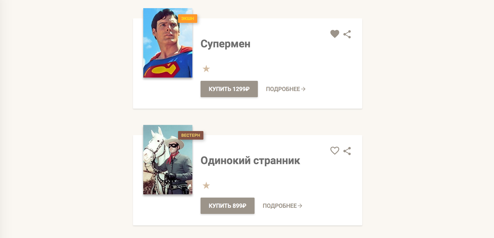

# Рейтинг фильмов

Необходимо реализовать компонент, отображающий рейтинг фильма в виде звёзд:


## Описание компонента

Для отображения рейтинга создайте компонент `Stars`, который принимает следующие атрибуты:

- `count` — рейтинг фильма, _число_, по умолчанию `0`.

Если рейтинг меньше `1` или больше `5`, или вообще не число, то компонент не должен иметь какого-либо представления в
DOM.

Звёзды рейтинга должны быть представлены тегом `<ul>` с классом `card-body-stars`. Для отображения символа звезды внутри
тега `<li>` используйте компонент `Star`.

## Пример использования

```jsx
// Внутри App
return (
    <Stars count={1}/>
);
```

Компонент должен дать следующий код:

```html

<ul class="card-body-stars u-clearfix">
    <li>
        <svg fill="#D3BCA2" height="28" viewBox="0 0 18 18" width="28" xmlns="http://www.w3.org/2000/svg">
            <path d="M9 11.3l3.71 2.7-1.42-4.36L15 7h-4.55L9 2.5 7.55 7H3l3.71 2.64L5.29 14z"/>
            <path d="M0 0h18v18H0z" fill="none"/>
        </svg>
    </li>
</ul>
```

## Реализация

Необходимо реализовать компонент `Stars`. Не забудьте, что отдельная звезда должна быть представлена компонентом `Star`.

Важно: вам нужно реализовать только отображение звёздочек, карточку фильма не нужно.


===================================================================================


# Список предложений

Необходимо вывести список предложений каталога Etsy.com, используя библиотеку React. После загрузки данных и отрисовки список должен выглядеть так:


## Данные списка предложений

Данные для списка доступны в формате JSON в каталоге `data`. Вам нужно их скопировать и хранить в виде константы в переменной. Для создания JS-объектов используйте `JSON.parse`.

Это _массив объектов_, каждый _объект_ представляет одно предложение. У предложения доступно множество свойств, но в приложении необходимо использовать следующие:
- `listing_id` — уникальный идентификатор предложения, _число_;
- `url` — ссылка на предложение, _строка_;
- `MainImage` — информация об изображении, _объект_, нам необходимо использовать свойство `url_570xN` для получения адреса главной картинки, _строка_;
- `title` — название предложения, _строка_;
- `currency_code` — код валюты, _строка_;
- `price` — цена, _строка_;
- `quantity` — доступное количество, _число_.

## Описание компонента

Для отображения списка создайте компонент `Listing`, который принимает следующие атрибуты:
- `items` — список предложений, _массив объектов_, по умолчанию пустой массив.

Компонент должен создавать на основе списка предложений следующий HTML-код:
```html
<div class="item-list">
  <div class="item">
    <div class="item-image">
      <a href="https://www.etsy.com/listing/292754135/woodland-fairy">
        
      </a>
    </div>
    <div class="item-details">
      <p class="item-title">Woodland Fairy</p>
      <p class="item-price">$3.99</p>
      <p class="item-quantity level-medium">12 left</p>
    </div>
  </div>
</div>
```

Если название предложения превышает `50` символов, то необходимо выводить только первые `50` символов, и добавлять символ `…` в конце.

При выводе стоимости предложения необходимо учитывать валюту. Если цена задана:
- в долларах США, код `USD`, то цену вывести в формате `$50.00`;
- в евро, код `EUR`, то цену вывести в формате `€50.00`;
- в остальных случаях цену вывести в формате `50.00 GBP`, где `GBP` — код валюты.

Вывести остаток, подсветив его в зависимости от количества, используя класс `level-*`:
- `level-low` — если остаток меньше `10` включительно;
- `level-medium` — если остаток меньше `20` включительно;
- `level-high` — если остаток больше `20`.

## Реализация

Необходимо отобразить данные списка предложений, используя компонент `Listing`.

Используйте приложенный CSS-файл для стилизации.
