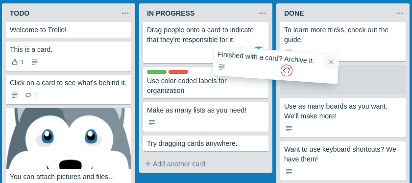

# Домашнее задание к занятию "6. Работа с файлами, DnD"

Правила сдачи задания:

1. **Важно**: в рамках этого ДЗ нужно использовать yarn (поэтому файла `package-lock.json` в репозитории быть не должно)
2. Всё должно собираться через Webpack (включая картинки и стили) и выкладываться на Github Pages через Appveyor
3. В README.md должен быть размещён бейджик сборки и ссылка на Github Pages
4. В качестве результата присылайте проверяющему ссылки на ваши GitHub-проекты
5. Авто-тесты писать не требуется

---

### Trello

#### Легенда

Вы делаете внутрикорпоративную систему управления задачами и вашему руководству очень нравится подход, который используется в [Trello](https://trello.com):

#### Описание

Фактически у вас есть доска, состоящая из колонок, в каждой колонке может быть несколько карточек.

Для упрощения сделаем следующие допущения:
1. Кол-во колонок фиксировано и равно 3
1. Новые колонки добавлять нельзя, удалять имеющиеся тоже
3. Перемещать колонки тоже нельзя

Что же можно:
1. Добавлять карточки с помощью кнопки 'Add another card'. Вот так это выглядит:

2. Удалять карточки - при наведении на карточку появляется иконка крестик ("\E951"), которая и удаляет карточку (обратите внимание в оригинальном Trello такой операции нет, есть только архивация, но мы для упрощения её ввели):

 
4. Перемещать карточки как внутри колонки, так и между колонками:

##### Процесс перемещения

1. Внешний вид до переноса (карточка находится на своём месте):

2. Внешний вид в момент переноса (карточка удаляется из своего начального положения):

Обратите внимание на следующие нюансы:
1. Внешний вид курсора ('grabbing')
2. Курсор по отношению к карточке остаётся там, где изначально схватили - не привязывается ни к левому краю, ни к центру, а там, где схватили карточку, т.е. можно схватить за нижний левый угол:

3. При наведении на другие позиции под карточку выделяется место по высоте равное размеру самой карточке, при это будет карточка ставится "до" или "после" элемента определяется исключительно позицией курсора:

##### Дополнительно

Дополнительные требования:
1. Храните всё состояние в LocalStorage так, чтобы после обновления страницы внесённые изменения сохранялись
1. Постоение DOM-дерева производите на базе состояния, хранящегося в LocalStorage

##### Упрощения

В целях упрощения сделайте только:
1. Возможность хранить текст (картинки, списки, цветовое оформление элементов не нужно)
2. Перемещение самой карточки (поворот делать не нужно)
3. Можете также не обрабатывать ситуацию, связанную с выносом элемента за пределы доски
